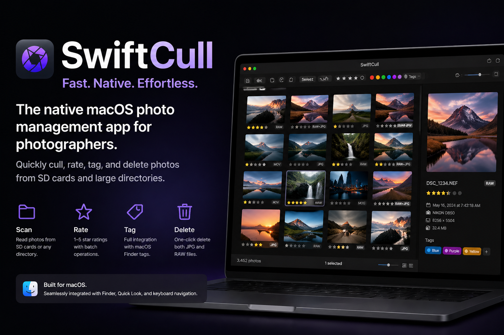

# ⚡ SwiftCull - 照片快筛



## 🎯 功能特性 SwiftCull

**1. 🚀 极速筛选，告别低效**  
面对 SD 卡中数千张照片，逐张查看费时费力。SwiftCull 支持按文件类型（RAW/JPG/MOV）、评分、Finder 标签和文件名智能筛选，配合键盘方向键导航和空格键 Quick Look 预览，让你像在 Finder 中一样快速浏览，筛选效率提升数倍。

**2. 🏷️ 原生标签，无缝协作**  
深度集成 macOS Finder 标签系统，自动发现你的自定义标签名称和颜色。在 SwiftCull 中标记的红色、黄色标签，在 Finder 中同样可见，反之亦然。评分与标签支持批量操作，选中多张照片一键设置，无需逐张处理。

**3. 🗑️ 一键清理，释放空间**  
每张照片往往同时存在 RAW 和 JPG 两个文件，手动删除容易遗漏。SwiftCull 自动识别配对文件，一键删除同时清理 RAW+JPG，连同 MOV 视频文件也一并管理，彻底释放存储空间。

## 🛠 系统要求

- macOS 14.0 (Sonoma) 或更高版本
- Xcode 16.0 或更高版本

## 🏗 构建与运行

1. 克隆仓库：
   ```bash
   git clone git@github.com:SAN-SHIa/SwiftCull.git
   cd SwiftCull
   ```

2. 生成 Xcode 项目（需要 [XcodeGen](https://github.com/yonaskolb/XcodeGen)）：
   ```bash
   brew install xcodegen
   xcodegen generate
   ```

3. 打开并运行：
   ```bash
   open SwiftCull.xcodeproj
   ```

   或使用命令行编译：
   ```bash
   xcodebuild -project SwiftCull.xcodeproj -scheme SwiftCull -configuration Debug build
   ```

## 📖 使用方法

1. 启动 SwiftCull — 自动加载配置路径中的照片
2. 点击**打开文件夹**或按 `⌘O` 选择其他目录
3. 单击照片选中，按**空格键**进行 Quick Look 大图预览
4. 使用**方向键**在照片间导航
5. 点击**选择**按钮进入批量选择模式
6. 在选择模式中，使用工具栏批量设置评分、标签或删除

## 🧩 项目架构

```
SwiftCull/
├── App/
│   └── SwiftCullApp.swift
├── Models/
│   ├── PhotoEntry.swift
│   └── FilterOptions.swift
├── Services/
│   ├── FileService.swift
│   ├── RatingService.swift
│   ├── TagService.swift
│   └── ThumbnailService.swift
├── ViewModels/
│   └── PhotoStore.swift
└── Views/
    ├── ContentView.swift
    ├── FilterSidebar.swift
    ├── PhotoGridView.swift
    ├── PhotoDetailView.swift
    ├── AsyncThumbnailView.swift
    └── RatingView.swift
```

## 📄 许可证

[MIT](./LICENSE)
