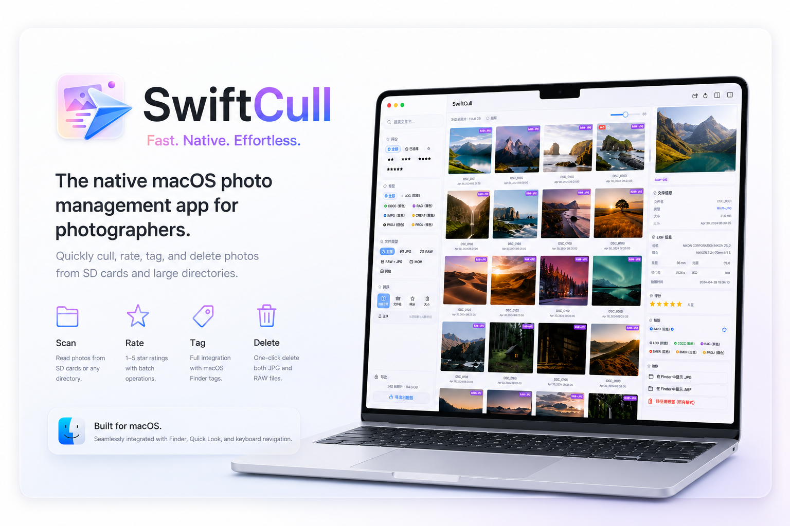
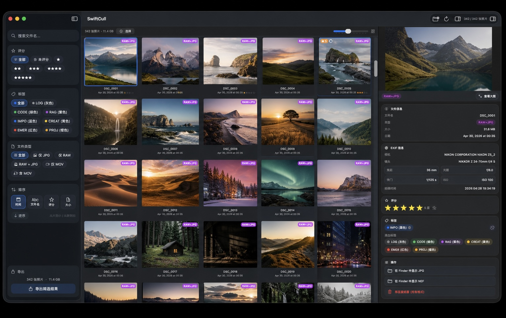
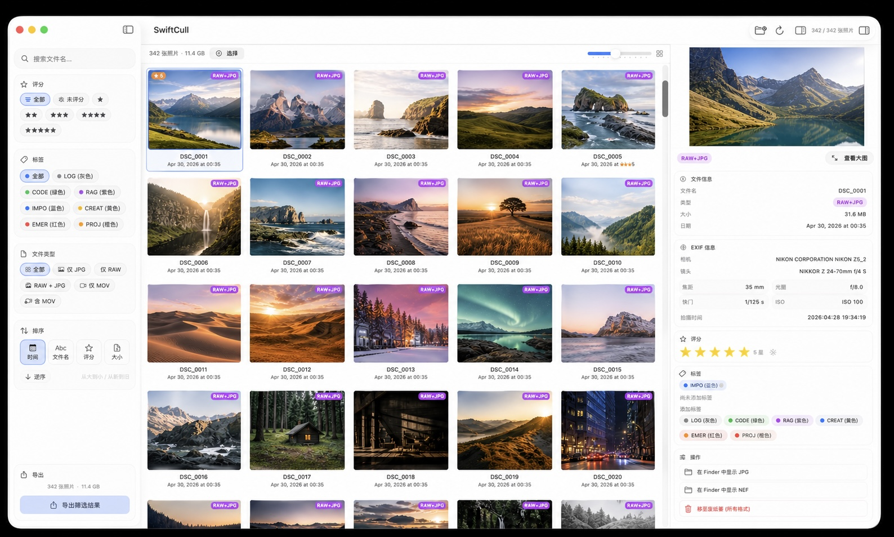

# ⚡ SwiftCull - 照片快筛

<div align="center">
  <div>
    <a href="https://github.com/SAN-SHIa/SwiftCull/releases"></a>
    <a href="https://github.com/SAN-SHIa/SwiftCull"></a>
    <a href="https://github.com/SAN-SHIa/SwiftCull/blob/main/LICENSE"></a>
    <a href="https://github.com/SAN-SHIa/SwiftCull"></a>
    <a href="https://github.com/SAN-SHIa/SwiftCull"></a>
  </div>
  <br>
</div>



> 一款为摄影师打造的 macOS 原生照片快速筛选工具。从 SD 卡里的数千张照片中，用最少的操作挑出该留的、删掉该删的。纯 SwiftUI + 系统原生框架，无第三方依赖。

## 📥 下载安装

前往 [Releases](https://github.com/SAN-SHIa/SwiftCull/releases) 页面下载最新版 `SwiftCull.dmg`，打开后将 SwiftCull 拖入 Applications 即可完成安装。

> **首次打开提示：** 由于应用未经过 Apple 公证（Notarization），macOS 可能会阻止打开。请前往「系统设置 → 隐私与安全性」，点击「仍要打开」即可。

## 🎯 功能特性

**1. 🚀 极速筛选，告别低效**
按文件类型（RAW / JPG / MOV）、评分、Finder 标签、文件名与拍摄日期多维筛选，并可按「月 / 日」分组浏览。方向键导航、空格键 Quick Look，像在 Finder 里一样顺手。支持拖拽框选、`⌘` 点选、`⇧` 连选，网格大小无级调节，上下键在任意网格尺寸下都精准跨行。

**2. 🔍 大图审片，细节尽览**
按 `E` 进入大图模式逐张审片。支持**触控板捏合、双击、`＋ / －` 按钮缩放**（最高 6×），放大后可拖拽平移查看细节，切换照片自动复位，是判断对焦是否精准、有没有糊片的利器。

**3. 🏷️ 原生标签与评分**
深度集成 macOS Finder 标签系统，自动发现你的自定义标签名称与颜色，双向可见。评分（1–5 星）与标签均支持批量操作：进入选择模式后一键作用于多张照片，**「完成」才写入磁盘、「取消」瞬间还原**，改错了也不心疼。

**4. 🗑️ 配对清理与导出**
每张照片常同时存在 RAW / JPG / MOV 多个文件，SwiftCull 自动识别配对，删除时一并移入废纸篓（可恢复），彻底释放存储空间。筛选结果可一键导出到指定目录，**导出在后台执行并显示实时进度，全程不卡顿**。

**5. 📷 EXIF 信息，一目了然**
自动提取相机型号、镜头、焦距、光圈、快门速度、ISO、拍摄时间等 EXIF 数据，基于 ImageIO 框架纯原生实现。

## 📸 界面预览

| 深色模式 | 浅色模式 |
|:--------:|:--------:|
|  |  |

## ⌨️ 快捷键

| 导航 / 预览 | 评分 | 视图 | 操作 |
|:----|:----|:----|:----|
| `←` `→` 上一张 / 下一张 | `1`–`5` 设置评分（支持批量） | `E` 网格 / 大图切换 | `A` 全选当前筛选结果 |
| `↑` `↓` 按列跨行跳转 | `0` 清除评分 | `Tab` 侧边栏开关 | `⌫` 删除选中（RAW+JPG+MOV） |
| `Space` Quick Look 预览 | | 大图下捏合 / 双击 / `＋ －` 缩放 | `Esc` 退出多选 / 取消输入焦点 |
| | | | `⌘O` 打开文件夹 · `⌘/` 快捷键手册 |

## 🛠 系统要求

- macOS 14.0 (Sonoma) 或更高版本
- Xcode 16.0 或更高版本（仅源码构建时需要）

## 🏗 构建与运行

**方式一：直接下载 DMG（推荐）**

前往 [Releases](https://github.com/SAN-SHIa/SwiftCull/releases) 下载 `SwiftCull.dmg`。

**方式二：源码构建**

1. 克隆仓库：
   ```bash
   git clone git@github.com:SAN-SHIa/SwiftCull.git
   cd SwiftCull
   ```

2. 生成 Xcode 项目（需要 [XcodeGen](https://github.com/yonaskolb/XcodeGen)）：
   ```bash
   brew install xcodegen
   xcodegen generate
   ```

3. 构建并运行：
   ```bash
   # 使用快捷脚本（推荐）
   ./run.sh           # Debug 构建并启动
   ./run.sh release   # Release 构建
   ./run.sh dmg       # 打包 DMG 安装包
   ./run.sh clean     # 清理构建产物
   ./run.sh help      # 查看所有命令
   ```

   或在 Xcode 中打开：
   ```bash
   open SwiftCull.xcodeproj
   ```

> 修改、增删源文件后，记得重新运行 `xcodegen generate`（或 `./run.sh gen`）同步工程。

## 📖 使用方法

1. 启动 SwiftCull — 自动检测已连接的 SD 卡与常用目录
2. 点击**打开文件夹**或按 `⌘O` 选择目录
3. 方向键在照片间导航，`Space` 唤起 Quick Look 大图预览
4. 按 `E` 进入大图模式审片，捏合 / 双击 / `＋ －` 缩放查看细节
5. `1`–`5` 打分、`⌫` 删除；点**选择**进入批量模式，一键批量评分 / 打标签 / 删除
6. 批量修改在点「完成」后写入，点「取消」则全部还原
7. 在侧边栏配置筛选与排序，点**导出筛选结果**把留下的照片拷贝到新目录

## 🧩 项目架构

纯 SwiftUI + MVVM，无第三方依赖。`PhotoStore` 作为唯一数据源统一管理状态与业务逻辑。

```
SwiftCull/
├── App/
│   ├── SwiftCullApp.swift             # 应用入口与菜单命令
│   └── KeyboardShortcutHandler.swift  # 全局键盘快捷键
├── Models/
│   ├── PhotoEntry.swift               # 照片数据模型（RAW/JPG/MOV 配对）
│   ├── FilterOptions.swift            # 筛选与排序条件
│   ├── FinderTag.swift                # Finder 标签模型
│   └── PhotoExifInfo.swift            # EXIF 信息与缓存
├── ViewModels/
│   └── PhotoStore.swift               # 应用状态与业务逻辑核心
├── Services/
│   ├── FileService.swift              # 目录扫描 / 文件配对 / 移入废纸篓
│   ├── RatingService.swift            # 评分持久化
│   ├── TagService.swift               # Finder 标签读写（扩展属性）
│   ├── FinderTagService.swift         # Finder 标签发现与配色
│   ├── ThumbnailService.swift         # 缩略图生成与内存 / 磁盘缓存
│   └── ProjectMetadataService.swift   # 项目 sidecar 元数据（.swiftcull）
└── Views/
    ├── ContentView.swift              # 三栏主界面
    ├── FilterSidebar.swift            # 筛选侧边栏 + 导出
    ├── PhotoGridView.swift            # 照片网格 / 分组 / 框选 / 批量栏
    ├── PhotoDetailView.swift          # 右侧详情（信息 / EXIF / 评分 / 标签）
    ├── PhotoCardView.swift            # 网格照片卡片
    ├── AsyncThumbnailView.swift       # 异步缩略图与大图加载
    ├── RatingView.swift               # 星级评分控件
    ├── WelcomeView.swift              # 欢迎页 / 大图审片 / 快捷键手册
    ├── SelectionCommandBar.swift      # 批量栏小组件
    └── Components/                    # GlassCard / FlowLayout / 按钮样式等
```

## 📄 许可证

[MIT](./LICENSE)
